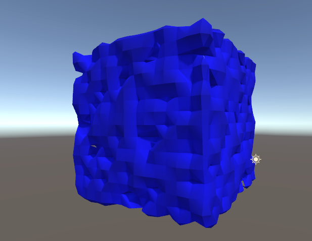

## Marching Cubes in Unity

This project is ann implementation of the Marching Cubes algorithm written in 2022, with the intention of being used for game terrain in an unreleased project. This was a partial rewrite of what is a now lost project which had tools to edit the density volume in real time.

While developing this, I used [this resource](https://paulbourke.net/geometry/polygonise/) by Paul Bourke for guidence & a working set of lookups.